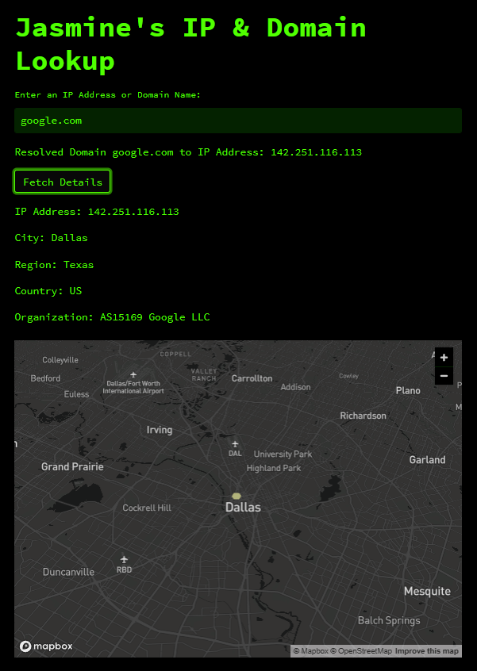

# Jasmine's IP & Domain Lookup 🌍🔍

A modern web application built with Streamlit that fetches and displays information about a given IP address or domain, along with its geolocation visualized on an interactive map.

  

## Features

- **IP Lookup**: Enter an IP address to get detailed information including City, Region, Country, and Organization.
- **Domain to IP Resolution**: Convert domain names to their corresponding IP addresses.
- **Interactive Geolocation Map**: Visualize the geographical location of the queried IP.
- **Hacker Aesthetic**: A sleek green-on-dark theme reminiscent of classic hacker culture.

## Installation & Setup

1. **Clone the repository**:
   ```bash
   git clone https://github.com/JasmineThai-hub/IP_Address_Info_Dashboard.git
   cd repo_name
   ```

2. **Install the required packages**:
   ```bash
   pip install -r requirements.txt
   ```

3. **Run Streamlit**:
   ```bash
   streamlit run main.py
   ```

## Customization

To adjust the visual theme, modify the `.streamlit/config.toml` file. More details on theming can be found in the [Streamlit documentation](https://docs.streamlit.io/).

---
This README was generated by ChatGPT
